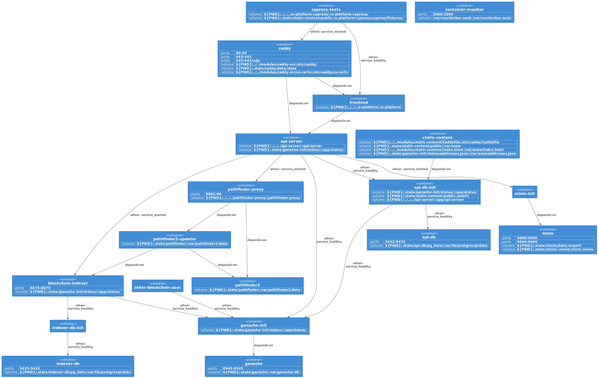

# Circles.land development environment
## Overview
This repository bundles all components of the circles.land server and client software
in a Docker Compose environment that you can use for development on your local machine.

__*Note*__: This setup is not meant to be used in production.
It uses unsecure default addresses, keys and passwords.

It starts the following services/containers:

| Repo                                                                     | Service               | Description                                                                               |
|--------------------------------------------------------------------------|-----------------------|-------------------------------------------------------------------------------------------|
| [o-platform](https://github.com/CirclesUBI/o-platform)                   | frontend              | The svelte based frontend application of circles.land                                     |
| [api-server](https://github.com/CirclesUBI/api-server)                   | api-server            | Provides access to all services trough a GraphQL api                                      |
| [blockchain-indexer](https://github.com/CirclesUBI/blockchain-indexer)   | blockchain-indexer    | Indexes circles related on-chain events and writes them to a postgres db                  |
| [pathfinder2](https://github.com/CirclesUBI/pathfinder2)                 | pathfinder2           | Finds transitive payment paths between untrusted users                                    | 
| [pathfinder2-updater](https://github.com/CirclesUBI/pathfinder2-updater) | pathfinder2-updater   | Updates the 'pathfinder2' with data from the 'blockchain-indexer'                         | 
| [pathfinder-proxy](https://github.com/CirclesUBI/pathfinder-proxy)       | pathfinder-proxy      | Maintains statistics, load balances and filters requests to the 'pathfinder2'             |
| [land-local](https://github.com/CirclesUBI/land-local)                   | api-db-init           | Executes the database migrations before each start of the api-server                      |
| [land-local](https://github.com/CirclesUBI/land-local)                   | indexer-db-init       | Executes the database migrations before each start of the blockchain-indexer              |
| [land-local](https://github.com/CirclesUBI/land-local)                   | ganache-init          | Executes the truffle migrations before each start of the api-server or blockchain-indexer |
| [land-local](https://github.com/CirclesUBI/land-local)                   | other-blockchain-user | Simulates usage from other users on the 'ganache' chain                                   |
| [minio](https://hub.docker.com/r/minio/minio)                            | minio                 | Provides a S3-compatible object storage                                                   |

Here is a graph of the startup dependencies of the services as found in the docker-compose files:  



## Modes
This repository contains two different docker-compose.yml files:
* /modes/__from-image__/docker-compose.yml
* /modes/__from-source__/docker-compose.yml

### from-image
Use this mode if you need an environment for testing or developing your own code
that uses the circles.land api. This mode uses the published images from 
dockerhub as configured in the /modes/from-image/docker-compose.yml file.

### from-source
Use this mode if you want to make changes to the circles.land codebase.  

In this mode, the frontend and the api-server are compiled from the local source code on your machine.
Then the webpack server and nodemon are used to serve the application and watch for changes.
All other services use the images from dockerhub. The services for this mode are defined 
in the /modes/from-source/docker-compose.yml file.

___Note:___ This mode assumes you cloned the repos into the following FS-hierarchy:  
* ../
  * land-local/
  * o-platform/
  * api-server/

## Usage
### Run the stack
1. Choose which mode you want to use and `cd` into the corresponding directory (modes/from-image or modes/from-source)
2. Run `docker compose up`
3. Run 'watch docker compose ps -a' on a different terminal and wait until all services become available (aren't restarting)
___Note:___ All '*-init' containers will exit and remain in that state once they finished their work. This is normal.
4. Visit http://localhost:8080 to access the UI

### Runtime state
All volumes are mounted in the `.state` directory of each mode. This means that the state of the setup
will be persisted between runs. If you want to start from scratch, run the following commands.
```shell
# Remove all containers, clean all runtime state and rebuild all containers that contain state
docker compose down \
 && sudo rm -r -f .state \
 && docker compose build --no-cache \
      api-db-init \
      indexer-db-init \
      other-blockchain-user \
      ganache \
      ganache-init \
      frontend
      
# Restart the stack
docker compose up
```